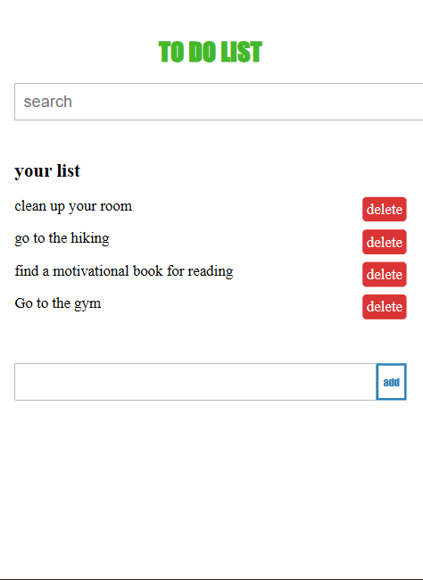
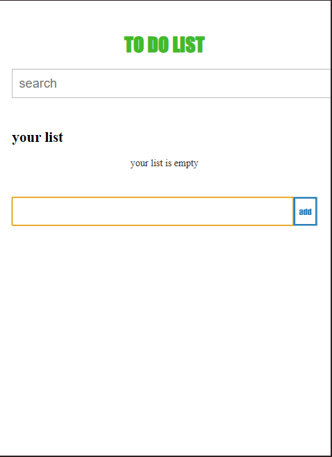

# To-Do List


## Overview

The To-Do List is a simple, interactive web application that allows users to manage their tasks efficiently. With features like adding tasks, searching, and deleting, it provides an easy way to organize your daily activities. This project is built using plain HTML, CSS, and JavaScript, and it is designed to showcase the power of simple front-end development.

## Prerequisites

To run this project locally, make sure you have the following:

- A web browser (Google Chrome, Firefox, Safari, etc.)
- Basic knowledge of HTML, CSS, and JavaScript
- A text editor for viewing or modifying the code (e.g., Visual Studio Code)

## Installation

1. **Clone the repository:**

   ```bash
   git clone https://github.com/sajjad-sisakhtpour/to-do-list.git
   ```

2. **Navigate to the project folder:**

   ```bash
   cd to-do-list
   ```

3. **Open `index.html` in your browser:**

   You can open the `index.html` file directly in your browser to see the application running.

## Usage

The To-Do List is a basic application with the following features:

- **Add Tasks:** Enter a task in the input box and click the 'Add' button to add it to the list.
- **Delete Tasks:** Click on the "delete" button next to any task to remove it from the list.
- **Search Tasks:** Use the search input at the top to filter tasks by name.

### Example

To add a task like "Buy groceries":

1. Type "Buy groceries" in the input box under the "Add Task" section.
2. Click the "Add" button, and the task will appear in the list.
3. You can delete it at any time by clicking the "delete" button next to it.

## Screenshots

Here are a few screenshots of the application:

- 
- 

## Documentation

This project uses vanilla HTML, CSS, and JavaScript. All the functionality is client-side, meaning no backend or database is used. The list is stored temporarily in the browser, and tasks are removed when the page is refreshed.

### Key Files:

- `index.html`: The main HTML structure of the project.
- `style.css`: Contains the CSS for styling the application.
- `script.js`: Handles the interactivity, including adding, deleting, and searching tasks.

## Contributing

If you'd like to contribute to this project, feel free to fork the repository, make your changes, and create a pull request.

### Steps to Contribute:

1. Fork the repository.
2. Clone your fork to your local machine.
3. Create a new branch for your changes.
4. Make your changes and commit them.
5. Push your changes to your fork.
6. Create a pull request.

## License

This project is licensed under the MIT License - see the [LICENSE](LICENSE) file for details.

## Contact

- Email: [sajjad.sisakhtpour@gmail.com](mailto:sajjad.sisakhtpour@gmail.com)
- GitHub: [github.com/sajjad-sisakhtpour](https://github.com/sajjad-sisakhtpour)
- LinkedIn: [ir.linkedin.com/in/sajad-sisakht-pour](https://ir.linkedin.com/in/sajad-sisakht-pour)

## Live Demo

You can view the live demo of the project here:

[Live Demo](https://your-live-demo-link.com)
